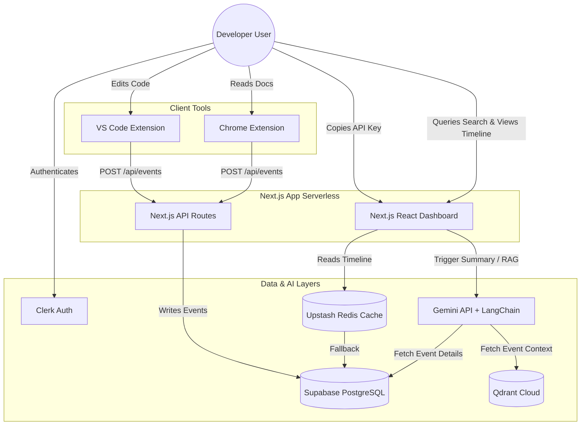

# Software Requirements Specification (SRS) - Simplified Portfolio Edition
## Project: FlowSense AI
### Document Version: 2.0.0 (Revised)
### Date: July 15, 2026

---

## 1. Executive Summary
FlowSense AI is a lightweight, production-quality Developer Context Recovery Platform built as a high-caliber portfolio project. The system is designed for single-developer implementation, prioritizing clean code, modern tech integration (AI & RAG), and rapid deployment. 

The platform runs two helper client extensions: a VS Code Extension to track basic file activities (Opened and Saved) and a Chrome Extension to record visits to developer documentation. These extensions send logs directly to a Next.js backend via REST API route handlers. Rather than utilizing background workers or queues, FlowSense AI uses on-demand AI services. The developer uses a Next.js dashboard containing a chronological timeline of recent activities and an interactive AI search bar. When requested, the platform compiles daily work summaries and answers questions using a simplified Retrieval-Augmented Generation (RAG) pipeline powered by Qdrant and Gemini.

---

## 2. Problem Statement
Context switching impairs developer focus. Interruptions from meetings, task transitions, and web searches result in lost cognitive flow. Reconstructing the mental state of "what was I doing" requires tracking:
1. What files were recently active in the IDE.
2. What reference materials were consulted online.
3. What changes were made.

FlowSense AI aggregates this context into a single personal dashboard, allowing the developer to query their immediate coding history using natural language.

---

## 3. Project Objectives
* **Educational Excellence**: Demonstrate expertise in full-stack Next.js, database integration (PostgreSQL & Prisma), extension development, and AI engineering (Gemini, LangChain, Qdrant).
* **Practical Utility**: Provide a working tool that helps the developer recall recent actions and build daily standup summaries.
* **Architecture Simplicity**: Avoid over-engineering, enterprise messaging patterns, background worker nodes, and complex database queues. Keep the stack clean and cost-effective.

---

## 4. Project Scope
### In Scope (MVP)
* **Authentication**: Clerk-based user sign-up, sign-in, and protected dashboard routes.
* **Client Telemetry**:
  * **VS Code Extension**: Transmits event data when a file is `Opened` or `Saved` inside a workspace.
  * **Chrome Extension**: Transmits URL visits constrained to a whitelist of documentation sites: GitHub, Stack Overflow, MDN, React Docs, Node.js Docs, and Redis Docs.
* **API Handlers**: Next.js route handlers acting as simple REST endpoints to ingest events and authenticate client keys.
* **On-Demand AI Functions**:
  * **Summary Generation**: Combines recent event logs and sends them to Gemini for summarization only when the user clicks "Generate Summary".
  * **Semantic RAG Search**: Accepts a user question, retrieves relevant event metadata from PostgreSQL/Qdrant, and runs it through Gemini to generate an answer.
* **Caching**: Upstash Redis used as a simple cache layer for the dashboard timeline and generated AI summaries.

### Out of Scope
* Real-time background embedding generation for every single event.
* Automated cron jobs, message queues, and worker servers.
* Enterprise collaborative features (multi-user team feeds, RBAC).

---

## 5. Stakeholders
* **Primary Developer / Creator**: Responsible for building and maintaining the project.
* **Technical Recruiters / Interviewers**: The audience reviewing this project to evaluate coding patterns, architectural decisions, and integration capabilities.

---

## 6. Functional Requirements (FR)

### FR-1: User Management & Session Security
* **FR-1.1**: Secure login and signup powered by Clerk.
* **FR-1.2**: Access to dashboard pages must require active Clerk sessions.
* **FR-1.3**: Next.js API routes must protect ingestion endpoints using user-specific API keys managed in the dashboard profile.

### FR-2: Event Ingestion (REST)
* **FR-2.1**: The system must provide a POST endpoint (`/api/events`) to ingest events from the extensions.
* **FR-2.2**: The VS Code Extension must send telemetry events payload matching `File Opened` and `File Saved` states.
* **FR-2.3**: The Chrome Extension must send URL visit events only if the page domain matches the whitelist.
* **FR-2.4**: Payload structure: User API Key, Event Type (`file_open`, `file_save`, `doc_visit`), Resource Name (file name/path, url), and Timestamp.

### FR-3: Data Core (PostgreSQL & Prisma)
* **FR-3.1**: The system must store telemetry events, user API keys, and generated summaries in PostgreSQL (Supabase) via Prisma ORM.
* **FR-3.2**: Event queries must support filtering by user ID and time ranges for dashboard visualization.

### FR-4: On-Demand AI Services (Gemini & Qdrant)
* **FR-4.1**: Clicking "Generate Summary" must trigger an API handler to fetch events from the selected day, call Gemini API using LangChain, and cache the output in Upstash Redis.
* **FR-4.2**: Semantic search queries must query vector representations of the user's event history stored in Qdrant Cloud.
* **FR-4.3**: The RAG flow must retrieve matching events, construct a prompt containing the event context and the user query, pass it to Gemini, and display the response.

### FR-5: Dashboard & UI
* **FR-5.1**: Provide a landing page demonstrating the product concept and capabilities.
* **FR-5.2**: Provide a dashboard containing a visual feed (timeline) of recent file activity and documentation visits.
* **FR-5.3**: Show simple analytics: Total coding time estimate, most edited files list, and top visited documentation domains.

---

## 7. Non-Functional Requirements (NFR)

### NFR-1: System Simplicity & Costs
* **NFR-1.1**: The entire backend must run inside Next.js Serverless Route Handlers to deploy directly to Vercel's free tier.
* **NFR-1.2**: Rely on free/hobby tiers of Supabase (PostgreSQL), Qdrant Cloud, Clerk, and Upstash Redis.

### NFR-2: Performance & Reliability
* **NFR-2.1**: Telemetry collection extensions must execute asynchronously without blocking developer IDE input.
* **NFR-2.2**: The Next.js API must validate ingestion tokens and save to PostgreSQL in `< 200ms` on average.

---

## 8. User Roles
1. **Developer User**: The sole authenticated workspace owner looking up their personal history and summaries.

---

## 9. User Stories
* **US-1**: As a developer, I want to create an account through Clerk, so that my coding history is stored separately and securely.
* **US-2**: As a developer, I want to copy my personal API key from my dashboard settings and add it to my VS Code extension configuration, so that it can push events to my account.
* **US-3**: As a developer, I want to view my dashboard timeline, so that I can see exactly what files I was working on and what documentation I had open.
* **US-4**: As a developer, I want to click a button to generate my daily summary, so that I can copy a breakdown of my achievements for my standup notes.
* **US-5**: As a developer, I want to ask, *"What MDN links did I visit while styling the landing page?"* in the RAG search bar, so that I can find my reference URLs.

---

## 10. Use Case Diagram (Text-based Mermaid)



---

## 11. High-Level System Architecture

FlowSense AI is structured as a single Next.js web application hosting both frontend pages and serverless API route handlers. Extensions communicate directly with these API routes.

```
+------------------+     +------------------+
| VS Code Ext.     |     | Chrome Extension |
| (File Open/Save) |     | (Docs Whitelist) |
+--------+---------+     +--------+---------+
         |                        |
         +----------+-------------+
                    | (POST JSON Payload via HTTPS)
                    v
       +----------------------------+
       |   Next.js API Handlers     |
       |  (Vercel Serverless/Edge)  |
       +-----+----------------+-----+
             |                |
    +--------+--------+  +----+----+  +-------------+
    | PostgreSQL DB   |  | Qdrant  |  | Upstash     |
    | (Supabase/Prisma|  | Vector  |  | Redis Cache |
    +-----------------+  +---------+  +-------------+
             |                |
             +--------+-------+
                      | (Context retrieval on request)
                      v
             +-----------------+
             | Gemini AI       | (Generates summaries/RAG answers)
             +-----------------+
```

---

## 12. Project Folder Structure

```
FlowSense-AI/
├── app/                  # Next.js App Router (pages, APIs, UI layout)
│   ├── api/              # Route Handlers (/api/events, /api/ai/summary, etc.)
│   ├── dashboard/        # Dashboard layout, pages, timeline component
│   └── page.js           # Public landing page
├── components/           # Reusable UI components (shadcn/ui, charts, timeline cards)
├── lib/                  # Shared utility code (prisma client, redis client, gemini client)
├── prisma/               # Schema configuration and database migrations
├── public/               # Static assets (images, icons)
├── vscode-extension/     # Independent VS Code extension folder (TypeScript)
├── browser-extension/    # Independent Chrome extension folder (Manifest V3)
├── package.json          # Next.js root package file
└── README.md             # Project documentation
```

---

## 13. Assumptions
* The developer runs a single local database instance (via Supabase) and standard free APIs for development.
* Whitelisted documentation tracking uses browser URL matching (no complex content parsing).
* Upstash Redis contains a cache expiration strategy (TTL) to avoid exceeding free-tier limits.

---

## 14. Constraints
* The application runs purely serverless, meaning any single API request must complete within standard Vercel serverless timeout limits (approx. 10s for free tiers). This requires efficient prompt design.
* The extensions rely on standard browser storage and local VS Code storage for caching configuration parameters (e.g., storing the API Key).

---

## 15. Risks and Mitigations

| Risk | Impact | Likelihood | Mitigation Strategy |
| :--- | :--- | :--- | :--- |
| **Privacy leak** of user code | High | Medium | Strictly capture filenames, directories, and event types. Never upload file contents or clipboard data. |
| **Free API limit exhaustion** | Medium | High | Perform AI generation and vector insertions strictly on-demand. Implement standard client-side event throttling in extensions. |
| **Serverless timeout** | Medium | Medium | Keep prompts concise. Use Redis caches to save processed answers and summaries. |

---

## 16. Future Scope
* **IDE Integrations**: Adding Python/Java support or multi-workspace tracking in the VS Code extension.
* **Additional Doc Whitelists**: Allowing the user to add custom URLs to their tracking whitelist.
* **Standup Integration**: Output formatting for Slack standups.

---

## 17. Success Metrics
* **Development Speed**: The single-developer project is successfully completed and deployed to production in 2–3 months.
* **Deployment Stability**: Uptime on Vercel remains >99.9% on hobby tier.
* **Portfolio Impact**: Codebase is clean, modular, and serves as a strong demonstration of modern SaaS engineering principles in job interviews.
